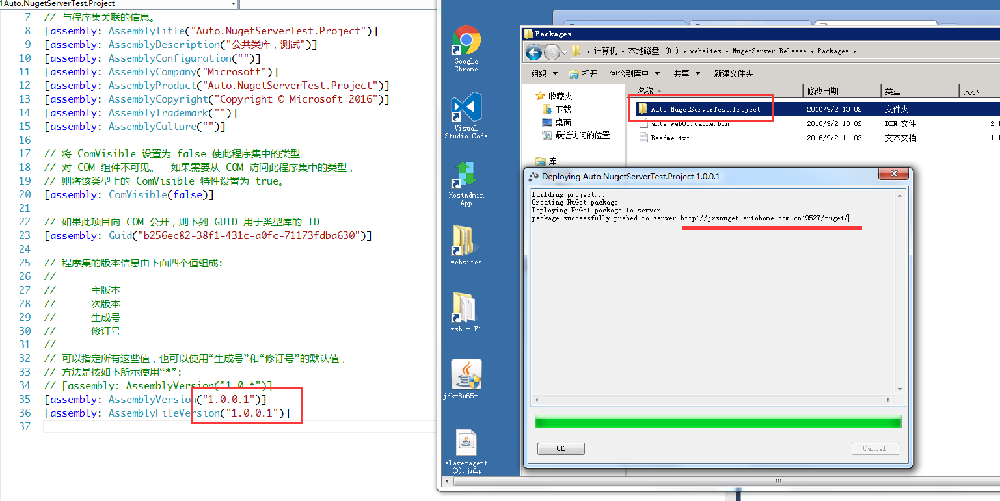

### NugetServer搭建步骤
* 新建一个基于Framework4.6+ 的空Asp.net Web Application项目；
* 引入Nuget.Server包，并在引入过程中选择同意，在覆盖Web.config配置时，选择“是”或者“全部是”；
* 配置Web.config中相关参数；
  * requireApiKey：请求NugetServer时，是否需要Key，安全起见建议启用；
  * apiKey：对应的口令，可以任意设置，调用时保持一致就可以了；
  * packagesPath：上传的Nuget包存放位置，默认是~/Packages下；你可以设置为其他目录，比如D:\Packages;
* 部署到IIS上，然后浏览即可；
* 在使用时，配置nuget Source就可以用了；
---
#### 发布程序包到NugetServer
* 需要安装一个Nuget Deploy插件，方便发布程序包；也可以使用Nuget Package Manager工具，但是相对比较费劲些；
* **配置Nuget Deploy**
  * 配置Nuget Path and Servers:需要用到一个Nuget.EXE;可以去官方下载(http://docs.nuget.org/consume/command-line-reference);
  * 配置远程NugetSever的地址和APIKey；
  

  * 发布之后，就可以在NugetServer服务器上看到的提交的程序包了。
  
